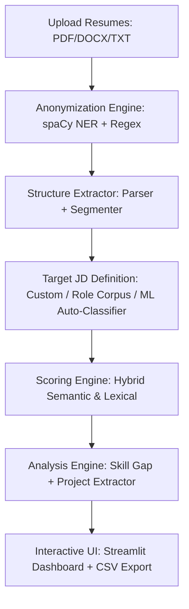

# Smart Recruitment Assistant with Resume Ranking and Skill Gap Analysis (v2.2)

An intelligent, enterprise-grade talent acquisition workspace that leverages advanced Natural Language Processing (NLP) and Machine Learning (ML) to parse resumes, predict candidate suitability, analyze skill coverage, and extract practical projects in real time.

---

## 🎯 Project Overview
The **Smart Recruitment Assistant** is a self-contained, high-performance recruiter dashboard. It streamlines the screening process by automatically extracting structural components of candidate resumes (contact details, skills, experience, and projects), anonymizing personally identifiable information (PII) to eliminate recruiter bias, scoring candidates against target job descriptions using a hybrid semantic-lexical formula, and rendering comprehensive visual charts.

---

## ⚙️ How the Project Works (System Process)

The screening pipeline operates in seven sequential stages:



1. **Upload & Ingestion**: The recruiter uploads one or multiple candidate resumes (PDF, DOCX, or TXT format) in the sidebar.
2. **PII Anonymization**: The text goes through a bias-mitigation engine. Using a combination of custom regex patterns and spaCy's Named Entity Recognition (`en_core_web_sm`), the system strips names, email addresses, and phone numbers before analysis.
3. **Structure Extraction**: The document parser extracts raw text and segments it into metadata (education, experience, work history, projects, and skills).
4. **Target Profile Alignment**: The recruiter defines the target job description (JD) in one of three ways:
   - **Paste Custom JD**: Directly paste the text of a specific job description.
   - **Auto-Detect Role (ML)**: A pre-trained Random Forest classifier trained on 2,484 labeled resumes predicts the best-fit role for the candidate batch and automatically generates a matching synthetic job description.
   - **Select Role**: Choose a standard job description from the built-in role corpus.
5. **Hybrid Scoring Engine**: Resumes are graded on a scale of `1.0 to 10.0` using a weighted three-part formula:
   $$\text{Final Score} = (0.50 \times \text{Semantic Score}) + (0.30 \times \text{Keyword Score}) + (0.20 \times \text{Experience Score})$$
   - **Semantic Score (50%)**: Measures conceptual alignment using Sentence-BERT (`all-mpnet-base-v2`) cosine similarity (or falls back to TF-IDF cosine if offline).
   - **Keyword Score (30%)**: Measures explicit bigram keyword overlap using TF-IDF token matching vs the job description.
   - **Experience Score (20%)**: Normalizes extracted years of experience against the requested minimum via a bell-curve function.
6. **Skill Gap & Project Analysis**:
   - Matches extracted skills against the target role's corpus to calculate **coverage %** and highlight **Present** vs **Missing** skills.
   - Parses the document for header zones to isolate projects (capturing project titles, descriptions, and skills mentioned).
7. **Interactive Presentation**: Renders results on the Streamlit dashboard and generates a downloadable CSV export.

---

## 🛠 Tech Stack (What We Used)

### Frontend (User Interface)
* **Streamlit**: For the interactive, glassmorphism-themed recruiter portal.
* **Plotly**: Renders interactive dynamic radar charts and stacked bar charts for candidate scores.
* **Pandas**: Manages data tables and CSV generation.

### Backend (REST API)
* **FastAPI**: High-performance Python web framework for serving endpoints.
* **Uvicorn**: Lightning-fast ASGI web server for hosting the FastAPI application.
* **Pydantic**: Robust data validation and JSON serialization.

### Natural Language Processing & Machine Learning
* **Sentence-Transformers**: Powering deep semantic understanding via the `all-mpnet-base-v2` SBERT model.
* **Scikit-Learn**: Powering TF-IDF feature extractions and the Random Forest role classifier.
* **spaCy**: Named Entity Recognition (`en_core_web_sm`) used to identify and mask PII (names, emails, phone numbers).
* **Document Parsers**: `pdfplumber`, `pdfminer.six` (for PDF), `python-docx` (for Word documents).

### Database & Security
* **MongoDB Atlas**: High-availability cloud NoSQL database for production data persistence.
* **SQLite**: Lightweight SQL database used as an automatic local development fallback.
* **Streamlit OAuth**: Handles popup-based Google OAuth login flows with secure backend token validation.
* **SMTP (Gmail)**: Authenticated SMTP client with secure retries/exponential backoff to dispatch OTP and security notifications.

---

## 📂 Project Structure

```
Resume_ranker/
├── backend/
│   ├── api/
│   │   └── main.py              # FastAPI Router - REST endpoints & OAuth callback
│   └── core/
│       ├── auth_manager.py      # Database layer (SQLite/MongoDB), SMTP emails, OAuth
│       ├── classifier.py        # ML Random Forest classifier & synthetic JDs
│       ├── parser.py            # Resume parser (PDF/Docx/TXT) & PII anonymizer
│       └── scoring_engine.py    # NLP hybrid scoring (SBERT, TF-IDF, Experience)
├── frontend/
│   ├── dashboard.py             # Streamlit Recruiter Dashboard UI
│   └── Logo.jpg                 # Logo image for dashboard sidebar
├── data/
│   ├── resume_dataset.csv       # Training data (2,484 labeled resumes)
│   └── users.db                 # Local SQLite database (auto-created)
├── tests/
│   └── test_scoring.py          # Pytest suite for scoring and experience parsing
├── docker/
│   ├── Dockerfile               # API & Dashboard Docker builds
│   └── docker-compose.yml       # Docker compose orchestrator
├── .env.example                 # Example configuration file
└── requirements.txt             # Locked python dependencies list
```

---

## 💻 Installations & Local Setup

### Prerequisites
* Python 3.9 - 3.11 installed.
* Pip (Python Package Installer).

### 1. Clone & Set Up Virtual Environment
Navigate to your project root folder and run:
```bash
# Create virtual environment
python -m venv venv

# Activate virtual environment (Windows PowerShell)
.\venv\Scripts\Activate.ps1

# Activate virtual environment (macOS/Linux)
source venv/bin/activate
```

### 2. Install Dependencies
Install all required packages from `requirements.txt` and download the spaCy language model:
```bash
pip install -r requirements.txt
python -m spacy download en_core_web_sm
```

### 3. Environment Variables (`.env`)
Create a `.env` file in the root directory. Use the template below to configure your settings:
```ini
# Database Connection (Leave blank to fall back automatically to local SQLite data/users.db)
MONGO_URI=mongodb+srv://<username>:<password>@cluster0.xxxx.mongodb.net/resume_ranker?retryWrites=true&w=majority

# API Host Settings
API_BASE_URL=http://localhost:8000

# Admin / Fallback Recruiter Account
ADMIN_EMAIL=recruiter@example.com
ADMIN_PASSWORD=admin_secure_password_123

# JWT Key for signing API sessions
JWT_SECRET=super_secret_jwt_key_hash_value_987654

# SMTP Configuration (Gmail recommended)
SMTP_HOST=smtp.gmail.com
SMTP_PORT=587
SMTP_USER=your-email@gmail.com
SMTP_PASSWORD=your-gmail-app-specific-password
SMTP_FROM=your-email@gmail.com

# Google OAuth Credentials
GOOGLE_CLIENT_ID=your-google-client-id.apps.googleusercontent.com
GOOGLE_CLIENT_SECRET=your-google-client-secret
GOOGLE_REDIRECT_URI=https://resumeranker-l9svhohk5tppdvd8yngazm.streamlit.app/component/streamlit_oauth.authorize_button/
```

---

## 🚀 Running the Project

### Running Locally (Zero-Setup)
When running locally, the Streamlit frontend automatically detects if the FastAPI backend server is offline and starts it in a background thread on port `8000`. 

You only need to run the Streamlit server:
```bash
streamlit run frontend/dashboard.py
```

* **Frontend Dashboard**: `http://localhost:8501`
* **Backend FastAPI Swagger Docs**: `http://localhost:8000/docs`

---

### Running with Docker Compose
If you prefer containerized deployment, you can build and run the services via Docker Compose:
```bash
cd docker
docker compose up --build
```
* **FastAPI Docs**: `http://localhost:8000/docs`
* **Streamlit Dashboard**: `http://localhost:8501`

---

## 🖥️ UI Layout & Page Walkthrough

### 1. The Welcome / Sign-In Page
* **Recruiter Sign-In / Sign-Up**: Recruiter accounts can sign in with their email and password or register a new account. Registration requires a 6-digit OTP verification code sent via SMTP to their pre-authorized email address.
* **Google OAuth**: Recruiters can sign in with their Google accounts using a popup-based authentication window.
* **Secure Notifications**: Every sign-in, sign-up, or sign-out action dispatches a security warning email with location/time details to protect candidate database access.

### 2. Main Workspace Dashboard
Once logged in, the UI splits into two sections:
* **The Sidebar Control Panel**:
  - **Upload Files**: Supports drag-and-drop ingestion of multiple resumes.
  - **JD Input**: Allows pasting a custom JD or selecting "Auto-detect role" (ML classifier mode).
  - **Min. Experience Slider**: Sets the minimum experience threshold for normalization.
  - **Anonymize PII Toggle**: Toggles name and contact details masking.
  - **Profile Settings Expander**: Recruiter can edit and save their profile display name.
* **The Leaderboard Workspace**: Renders the ranked candidate list with a Plotly stacked bar chart showing component scores and a download button to export results as a CSV.

### 3. Candidate Tabs Section (Per Candidate)
Expanding a candidate card displays six detailed analysis tabs:
1. **📈 Scores**: A Plotly radar chart displaying candidate metrics across Semantic, Keyword, Experience, Skill Breadth, and Overall Score.
2. **🛠 Skills**: Displays extracted skills categorized into folders (e.g., Programming Languages, Databases, AI/ML, Cloud/DevOps).
3. **🗂 Projects**: A dedicated projects portal listing detected project titles, descriptions, and the skills used in each project.
4. **🔍 Skill Gap**: A color-coded gauge representing expected skill coverage. It lists **Skills Present** (green tags) and **Skills Missing** (red tags) side by side.
5. **🔑 Keywords**: Displays the specific vocabulary matched between the candidate's resume and the job description.
6. **📝 Explanation**: Natural language scoring explanation detailing how the hybrid algorithm calculated each component score.

---

## 🔮 Future Enhancements
* **Weighted Scoring Customization**: Allow recruiters to manually adjust SBERT semantic vs TF-IDF keyword weights (e.g. increase experience weight to 40%).
* **Candidate Email Scheduling**: Enable recruiters to directly schedule email interviews or send automated rejection/acceptance notifications from the dashboard.
* **Collaborative Screening Notes**: Support multi-recruiter accounts with shared comment boxes and custom ratings per candidate.